# XAI-JQP: Explainable AI-Guided Joint Quantization and Pruning of Large Language Models

XAI-JQP is a research framework for compressing decoder-only large language models with a **single
attribution-based importance spectrum**. Layer-wise Integrated Gradients (Captum) score every attention
head and every MLP block of a model; from that one spectrum the framework derives *both* the structural
pruning decision (which heads to remove) and the precision decision (which modules to keep in FP16, which
to quantize to INT4, optionally INT8). The joint decision is compared, at an identical compression
budget, with random, magnitude, Taylor, Wanda and attention-confidence selectors and with uniform
post-training quantization baselines (NF4, GPTQ, AWQ, HQQ). The framework also measures how compression
shifts the explainability profile of the model (*attribution drift*) and when perplexity and downstream
task accuracy diverge.

Models used in the reference experiments: `mistralai/Mistral-7B-Instruct-v0.3` (FP16) and
`Qwen/Qwen2.5-7B-Instruct` (BF16). The code is model-agnostic for the Mistral / Llama / Qwen2 decoder
families (grouped-query attention and attention biases are handled).

**Author:** Prof. Dr. Şeref Sağıroğlu, Onur Berke Altın, Gazi University · **License:** Apache 2.0

---

## Method overview

1. **Calibration.** 16 WikiText-2 passages (about 2.7k tokens); an alternative 16-document C4 subset is
   used for the domain-sensitivity experiments.
2. **Structural attribution scoring** (`src/xai_engine.py`). Captum `LayerIntegratedGradients`
   (8 steps) produces one importance score per attention head (1024 for Mistral-7B) and per MLP block.
3. **Tier allocation** (`src/compressor.py`). Within-type percentiles assign heads to
   *prune / INT4 / FP16* (optionally a fourth INT8 tier) and MLP blocks to *INT4 / FP16*. A median rule
   decides the quantization of a layer's attention projections from the lower median of its head tiers.
4. **Compression.** Masked or physical head removal plus bitsandbytes NF4 (HQQ 2–8 bit for the
   mixed-bit experiments). The **iterative** variant re-scores the surviving heads after each of three
   pruning rounds; the final configuration is `xai_iter_fixedq` (iterative pruning, single-shot INT4 plan).
5. **Evaluation.** WikiText-2 (in-domain) and C4 (out-of-domain) perplexity; HellaSwag, ARC-Challenge and
   MMLU subsets (500 items each, zero-shot); model size; latency.
6. **Statistics** (pre-registered). Exact binomial McNemar tests per seed with Holm correction within a
   family, a paired window bootstrap (10 000 resamples) for perplexity, and "better than random" claims
   only when significant against all three random seeds. Drift is measured as Spearman ρ between round-0
   and post-pruning scores of the surviving heads and as top-k Jaccard overlap.

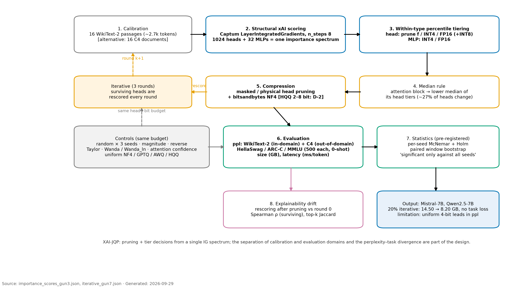

*One Integrated-Gradients importance spectrum drives both head pruning and per-module precision tiers, and every configuration is evaluated against same-budget controls on in-domain and out-of-domain data.*

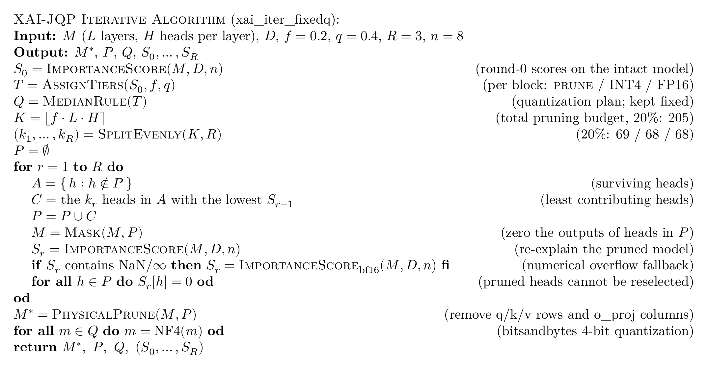

*Algorithm 1 (final configuration `xai_iter_fixedq`): the head budget is pruned over three rounds, the surviving heads are re-scored after every round, and the INT4 plan derived from the round-0 scores stays fixed.*

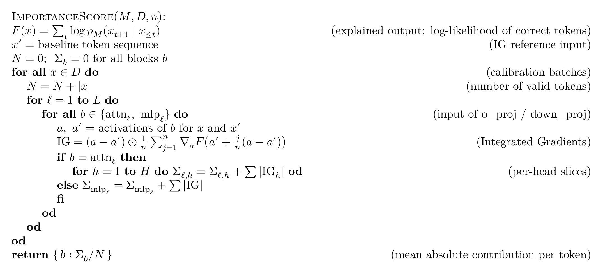

*Procedure 1: the importance of each attention head and MLP block is its mean absolute Integrated-Gradients attribution per token, computed on 16 WikiText-2 calibration passages with 8 integration steps.*

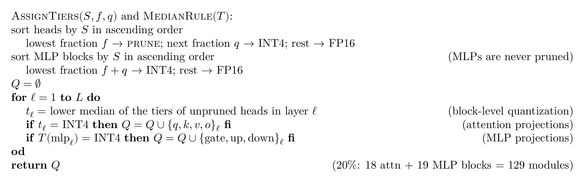

*Procedure 2: within-type percentiles assign heads to prune / INT4 / FP16 (205 / 410 / 409 at 20 %), and the median rule turns the head tiers of each layer into a block-level plan of 129 INT4 modules.*

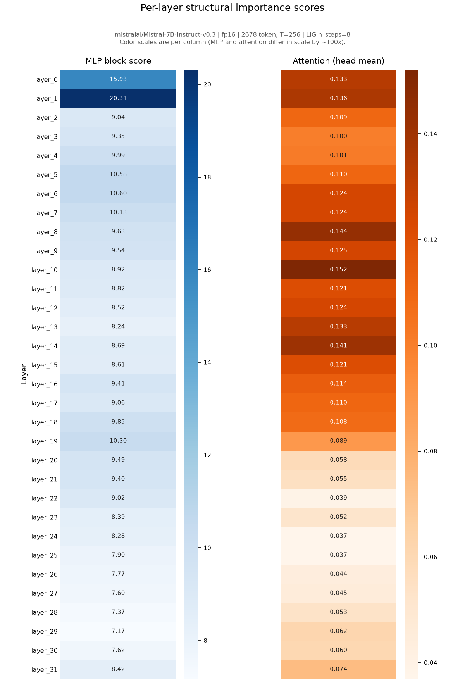

*Per-layer importance scores of Mistral-7B (MLP block score and mean head score; colour scales are per column). MLP blocks peak in layers 0–1, while attention importance stays high up to layer 19 and drops sharply from layer 20 on. Generated by `tools/visualization/visualize_importance.py`.*

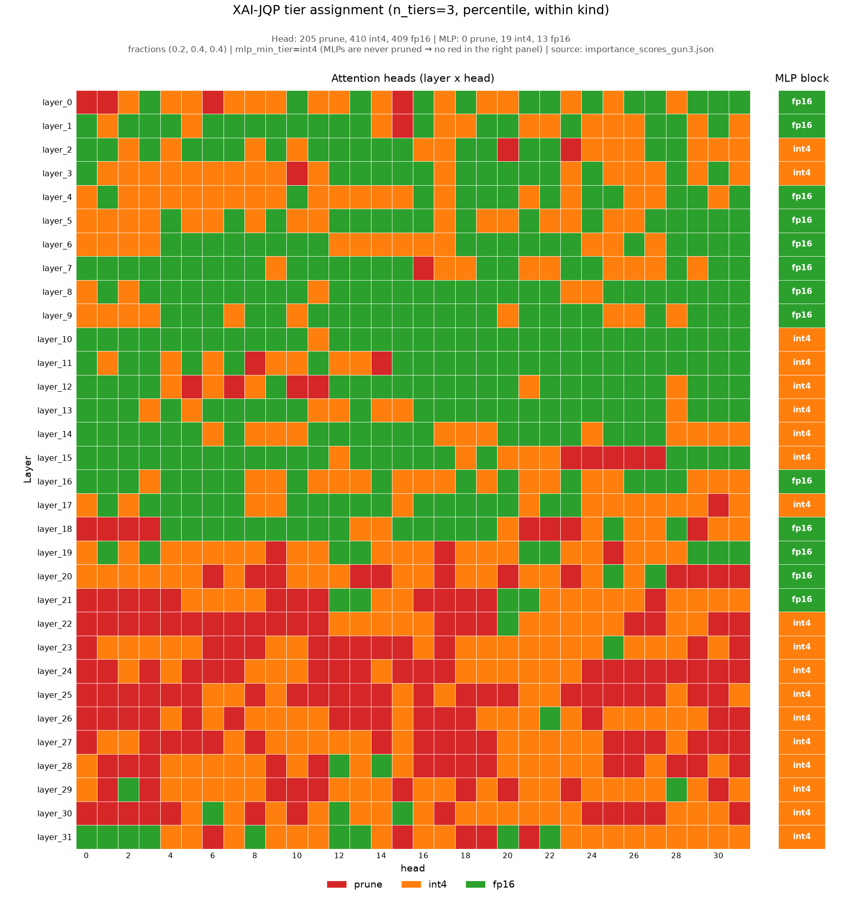

*Three-tier assignment at a 20 % pruning ratio: 205 heads pruned, 410 INT4, 409 FP16; MLP blocks are never pruned (19 INT4, 13 FP16). Pruned heads concentrate in the late layers (20–30). Generated by `tools/visualization/visualize_tiers.py`.*

"Pruning ratio" always denotes the fraction of attention heads (blocks) removed, not the fraction of
parameters (20 % of heads ≈ 3.1 % of the parameters of Mistral-7B).

## Headline results (Mistral-7B-Instruct-v0.3, FP16 reference)

| configuration | GB | ppl WikiText-2 | ppl C4 | HellaSwag | ARC-C | MMLU |
|---|---:|---:|---:|---:|---:|---:|
| FP16 (reference) | 14.50 | 5.22 | 7.83 | 0.832 | 0.592 | 0.546 |
| XAI-JQP iterative, 20 % heads + INT4 (physical) | 8.20 | 5.87 | 8.64 | 0.828 | 0.578 | 0.552 |
| random 20 % heads + same INT4 plan (3 seeds) | 8.34 | 7.55 ± 1.31 | – | 0.766 ± 0.011 | 0.499 ± 0.008 | 0.453 ± 0.059 |
| uniform NF4 (no pruning) | 4.03 | 5.31 | – | – | – | 0.530 |
| Qwen2.5-7B: BF16 → XAI-JQP iterative 20 % (masked + INT4) | 15.70 → 9.76 | 7.09 → 12.50 | – | 0.802 → 0.788 | 0.540 → 0.526 | 0.686 → 0.678 |

Every reported number is regenerated from `results/*.json` by `tools/visualization/make_figures.py`;
the table above is a condensed excerpt. Negative findings are reported as well: uniform 4-bit
quantization remains ahead in absolute compression, the attention-confidence selector is worse than
random, and physical head removal yields no latency gain (±3 %). The full findings, a claim table with
significance and scope, all negative results and the limitations, each number with its source JSON, are in
[RESULTS.md](RESULTS.md).

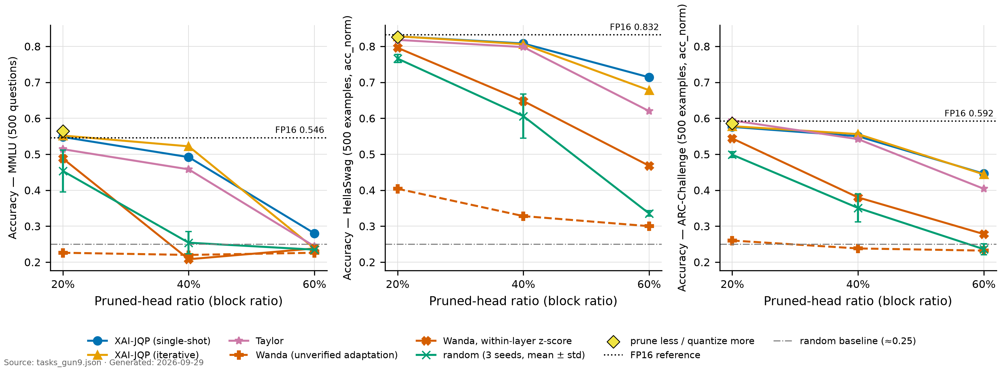

*Task accuracy against the pruned-head ratio: at 20 % iterative XAI-JQP reaches HellaSwag 0.828 / ARC-C 0.578 / MMLU 0.552 (FP16 0.832 / 0.592 / 0.546), and xAI selection beats random selection in 18 / 18 Holm-corrected HellaSwag and ARC-C comparisons.*

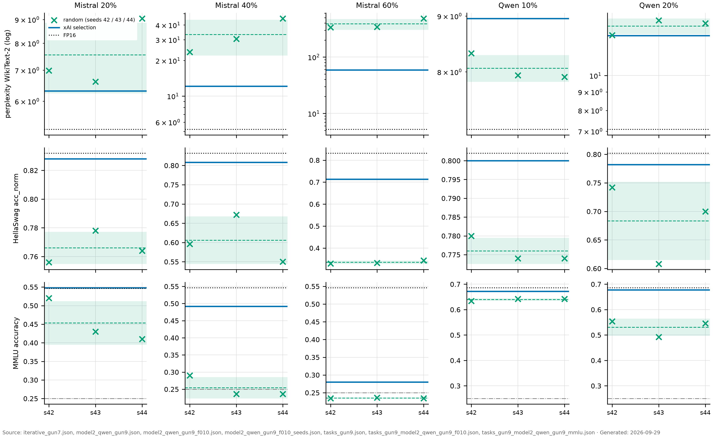

*Per-seed view of the random control: on Mistral-7B xAI selection is ahead of all three random seeds, whereas on Qwen2.5-7B at 10 % random pruning has lower perplexity (+0.63 to +1.04 in favour of random) and no task difference is significant after Holm correction.*

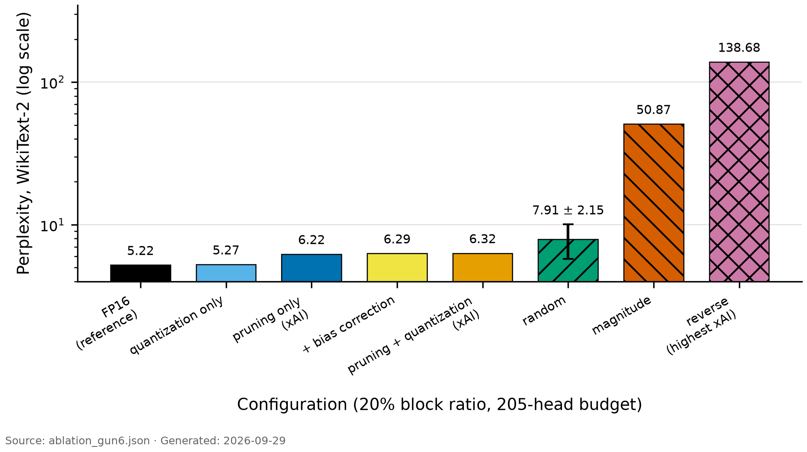

*Pruning-only ablation at the same 205-head budget: xAI selection reaches a WikiText-2 perplexity of 6.22, against 7.91 ± 2.15 for random, 50.87 for magnitude and 138.68 for pruning the highest-scored heads (FP16 5.22).*

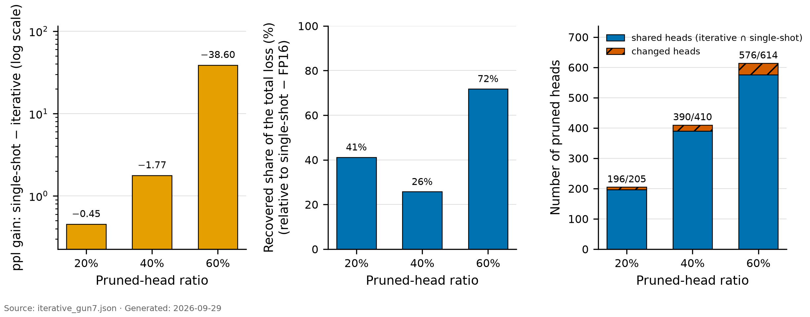

*Iterative re-scoring recovers 41 %, 26 % and 72 % of the single-shot perplexity loss at 20 / 40 / 60 % while sharing most pruned heads with single-shot (196 / 205, 390 / 410, 576 / 614); none of the nine task comparisons against single-shot is significant after Holm correction.*

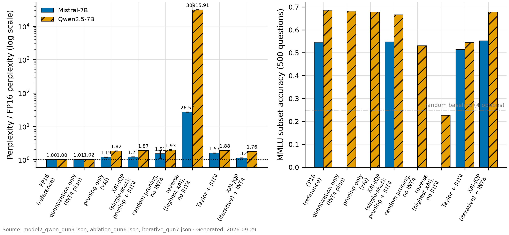

*On Qwen2.5-7B the same pipeline at 20 % keeps MMLU at 0.678 (BF16 0.686) against 0.531 ± 0.034 for random pruning, although pruning costs more perplexity than on Mistral-7B.*

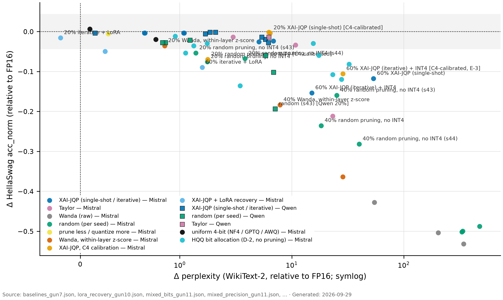

*Perplexity change is a poor predictor of task change: the C4-calibrated iterative model at 60 % has a higher WikiText-2 perplexity than the WikiText-2-calibrated one (33.89 vs 20.36) yet a better HellaSwag accuracy (0.726 vs 0.678, Holm-corrected p = 0.0056).*

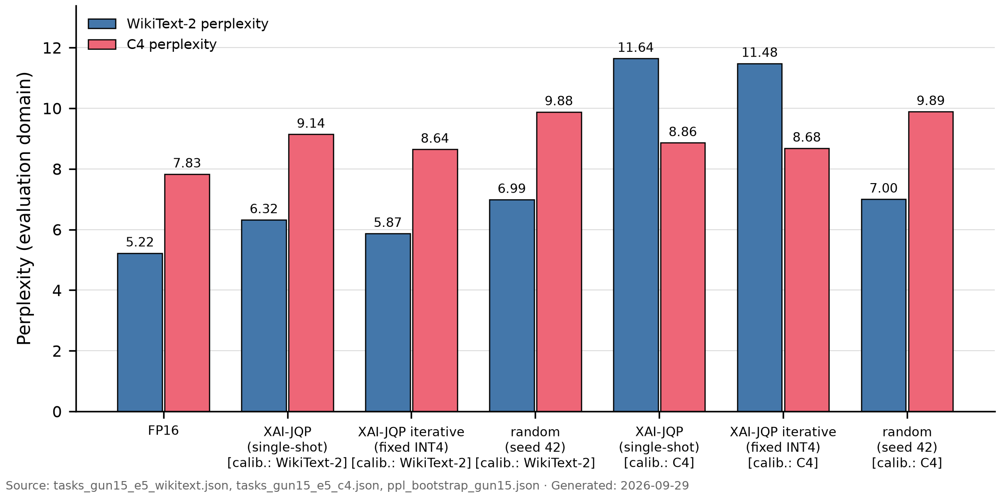

*The calibration domain matters: calibrating on C4 instead of WikiText-2 raises the single-shot WikiText-2 perplexity by +5.32 [+5.15, +5.50] but lowers C4 perplexity by only 0.28 [0.22, 0.34], with no measurable change in task accuracy.*

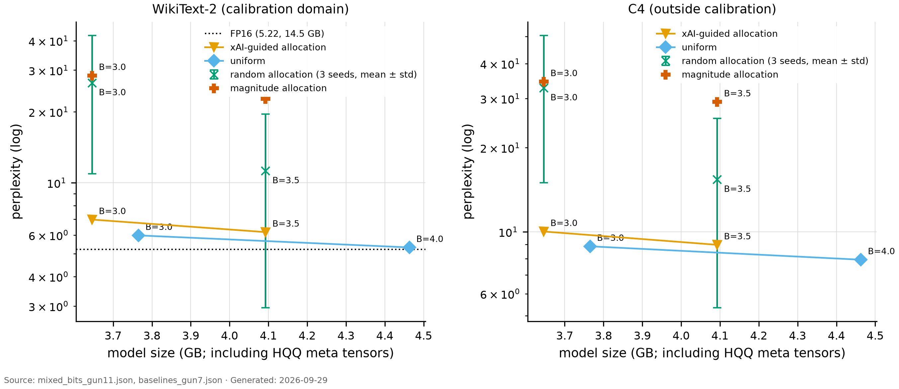

*HQQ bit allocation without pruning at an average budget of 3.0 bits: xAI-guided allocation (perplexity 6.98) is far ahead of random (26.51 ± 15.61) and magnitude (28.48) allocation but stays behind uniform 3-bit (5.98).*

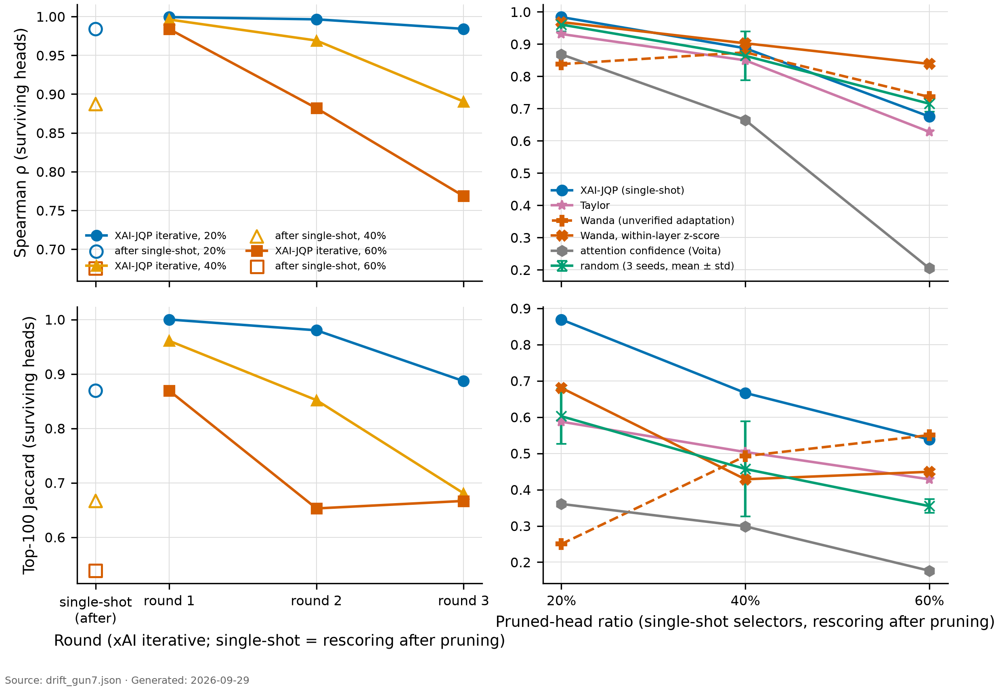

*Explanations remain stable at 20 % (surviving-head Spearman ρ 0.984 for single-shot and after the third iterative round) but drift at 60 % (0.675 single-shot, 0.769 iterative, 0.205 for the attention-confidence selector).*

## Repository layout

```
XAI-JQP-Optimization/
├── src/                      core library (imported by everything else)
│   ├── xai_engine.py         Integrated-Gradients importance scores for heads and MLP blocks
│   ├── compressor.py         tier allocation, median rule, masked/physical pruning, bnb/HQQ quantization,
│   │                         selector criteria (magnitude, Taylor, Wanda, attention confidence)
│   ├── drift_metrics.py      Spearman / top-k Jaccard drift metrics
│   ├── compute_drift.py      drift report from stored score files (no GPU)
│   ├── eval_mmlu.py          MMLU subset evaluation
│   ├── eval_tasks.py         HellaSwag / ARC-Challenge subset evaluation
│   └── eval_ppl_windows.py   window-level NLL and paired bootstrap for perplexity
├── experiments/              GPU run scripts (each has --preflight, --dry-run and --resume)
│   ├── run_xai_on_mistral.py    attribution scores (WikiText-2 or C4 calibration)
│   ├── run_e2e_pipeline.py      end-to-end prototype (shared Logger / ResultStore / model loading)
│   ├── run_ablation_tests.py    ablation: pruning only, quantization only, both, controls
│   ├── run_iterative_pruning.py main run: ratio sweep, iterative XAI-JQP, selector controls,
│   │                            four-tier variant, mixed precision (D-1), C4 calibration
│   ├── run_baselines.py         uniform NF4 / GPTQ / AWQ baselines
│   ├── run_qwen_experiments.py  second model (Qwen2.5-7B)
│   ├── run_eval_from_plans.py   task accuracy and two-domain perplexity for stored plans
│   ├── run_mixed_precision.py   HQQ mixed-bit allocation (D-2)
│   └── run_lora_recovery.py     QLoRA recovery after pruning (C-1)
├── tools/
│   ├── evaluation/           baseline_eval.py, compare_scores.py, compare_tasks_paired.py (McNemar + Holm),
│   │                         measure_speed.py
│   ├── diagnostics/          diagnose_wanda.py, diagnose_qwen_kernel.py, diagnose_calib_domain.py,
│   │                         diagnose_layer_concentration.py
│   └── visualization/        make_figures.py (all tables and figures), visualize_importance.py and
│                             visualize_tiers.py (assets/importance_heatmap.png, assets/tier_assignment.png)
├── results/                  raw result JSONs of all runs (source of every table and figure)
├── assets/                   README figures and algorithm listings (English)
├── tests/                    CPU-only test-suite on small randomly initialised models (169 tests)
├── requirements.txt          GPU host environment (pinned)
├── requirements-local.txt    local CPU environment for the tests
└── requirements-quant.txt    separate environment for the GPTQ / AWQ baselines
```

**Generated directories.** `results/*.json` are part of the repository so that every table and figure can
be regenerated without a GPU. `figures/`, `tables/`, `logs/` and `dryrun_out/` are **not part of the
repository**; generate them locally with `python tools/visualization/make_figures.py`. They are created on
demand by the scripts (`os.makedirs(..., exist_ok=True)`): run scripts write `results/*.json` and
`log_*.txt`, `make_figures.py` writes `figures/*.png` and `tables/*.md|.tex`, and `--dry-run` invocations
write under `dryrun_out/`. All paths are relative to the repository root, so run every command from the root.

**Result file names.** The `_gunN` suffix in result file names (e.g. `importance_scores_gun3.json`,
`iterative_gun7.json`) is an experiment-stage identifier: *gün* is Turkish for "day", and N numbers the
stages in the order they were run. Scripts, tests and tables refer to the files by these names, so they are
kept as they are. Likewise, some descriptive metadata strings inside the raw JSON files (for example
`note`, `scoring`, `assumptions` or recorded error messages) are in Turkish; they were left unchanged to keep
the raw records intact. Numeric values and the fields read by the scripts are not affected.

## Installation

### GPU host (reference setup: RunPod, one NVIDIA L40S 48 GB, Python 3.11)

```bash
pip install -r requirements.txt          # torch, transformers==4.44.2, bitsandbytes, captum, peft==0.12.0, datasets
pip install hqq==0.2.8.post1             # optional: mixed-bit experiments (run_mixed_precision.py)
```

The GPTQ / AWQ baselines need packages that conflict with the main pins; install them in a separate
virtual environment that inherits the main packages:

```bash
python -m venv --system-site-packages /workspace/.venv-quant
/workspace/.venv-quant/bin/pip install -r requirements-quant.txt
```

Notes for the GPU host:

- The scripts set `HF_HOME` to `/workspace/hf_cache` unless the variable is already defined, so that the
  model cache survives pod restarts. `/workspace` is the persistent volume of a RunPod pod; on any other machine,
  export your own `HF_HOME` to override it. Likewise, `run_baselines.py` stores quantized GPTQ / AWQ checkpoints under
  `/workspace/quant_cache` by default; pass `--quant-cache <dir>` to change it.
- Mistral-7B-Instruct is a gated model on the Hugging Face Hub; log in with a token that has access.
- Long runs are meant to be started with `nohup ... &` and followed with `tail -f log_*.txt`; all run
  scripts save partial results atomically and can be restarted with `--resume`.

### Local machine (CPU only; tests, drift metrics, tables and figures)

```bash
python -m venv .venv
.venv/Scripts/activate            # Windows   |   source .venv/bin/activate   # Linux / macOS
pip install -r requirements-local.txt
pytest tests/ -q                  # 169 tests, about 90 s, no model download
```

The local requirements are deliberately unpinned: the pinned `transformers==4.44.2` needs an old
`tokenizers` wheel that is not available for Python 3.12+. The tests use small randomly initialised
Mistral and Qwen2 models and stub out `captum`/`datasets` when they are missing, so they exercise the
full code path without a GPU.

## Running the pipeline

All commands are run from the repository root. Every GPU script supports `--preflight` (validate
inputs and budgets without loading the model), `--dry-run` (CPU, small model, outputs under `dryrun_out/`)
and `--resume`.

```bash
# 1. Attribution scores (about 6 min on an L40S)
python experiments/run_xai_on_mistral.py --n-steps 8 --output results/importance_scores_gun3.json
python experiments/run_xai_on_mistral.py --calib-dataset c4          # out-of-domain calibration set

# 2. Inspect the tier allocation without touching a model
python src/compressor.py --scores results/importance_scores_gun3.json --n-tiers 3

# 3. Main run: ratio sweep (20/40/60 % of heads), iterative XAI-JQP, selector controls
python experiments/run_iterative_pruning.py --preflight
python experiments/run_iterative_pruning.py --fractions 0.2,0.4,0.6 --n-repeats 3
python experiments/run_iterative_pruning.py --calib-dataset c4 --fractions 0.6 --configs xai_iter_fixedq

# 4. Task accuracy and two-domain perplexity for the stored plans
python experiments/run_eval_from_plans.py --plan results/iterative_gun7.json --with-mmlu \
       --ppl-datasets wikitext2,c4 --save-window-nll

# 5. Baselines, second model, mixed precision, LoRA recovery, latency
python experiments/run_baselines.py --configs nf4_uniform,gptq_4bit,awq_4bit
python experiments/run_qwen_experiments.py --dtype bf16 --fraction 0.2
python experiments/run_mixed_precision.py --save-window-nll
python experiments/run_lora_recovery.py --with-tasks
python tools/evaluation/measure_speed.py --plan results/iterative_gun7.json --heads-from xai_iter_fixedq \
       --variants fp16,masked,physical,physical_int4

# 6. Statistics and drift (no GPU)
python tools/evaluation/compare_tasks_paired.py --tasks results/tasks_gun9.json     # McNemar + Holm
python src/eval_ppl_windows.py --tasks results/tasks_gun15_e5_wikitext.json --pair A B
python src/compute_drift.py

# 7. All tables and figures (no GPU)
python tools/visualization/make_figures.py
python tools/visualization/make_figures.py --which kapanis_ana_sonuc,kapanis_kontroller
# README figures in assets/ (English percent notation, e.g. "20%")
python tools/visualization/make_figures.py --english-notation \
    --which kapanis_yontem_akis,kapanis_ayrisma_hellaswag,gorevler,e5_iki_alan,kapanis_d2_pareto
```

`python <script> --help` lists every option. Result files are plain JSON with a `run` block
(arguments, environment, timing) and either `fractions.<f>.configs.<name>.repeats[]` or
`entries.<key>` records; `make_figures.py` reads only these files.

## Quick CPU demonstration

`tests/test_pipeline_cpu.py` chains the three stages on a small random model in a few seconds:

```bash
python tests/test_pipeline_cpu.py --n-steps 4
```

It prints the attribution report and the tier allocation, and verifies that the importance of a pruned
head is exactly zero after re-scoring.

## Reproducibility notes

- Random controls use fixed seeds (42, 43, 44); the MMLU / HellaSwag / ARC subsets are stored as id lists
  next to the results and verified by sha1 on every run.
- Model weights and LoRA adapters are never stored in the repository; only metrics are.
- Generated LaTeX tables contain Unicode cells and compile with XeLaTeX or LuaLaTeX.

## License

Copyright 2026 Prof. Dr. Şeref Sağıroğlu, Onur Berke Altın, Gazi University. Released under the Apache License, Version 2.0; see `LICENSE`.
